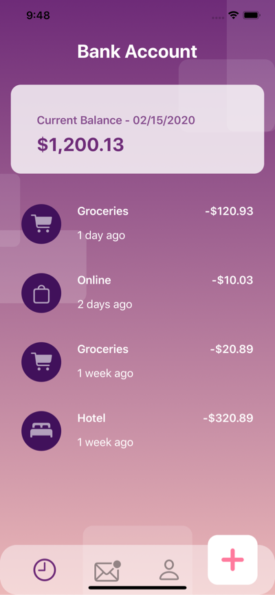

#  BankingUI with SwiftUI

## Inspiration

* [https://dribbble.com/shots/6009202-Wallet-App-Interaction](https://dribbble.com/shots/6009202-Wallet-App-Interaction) by [Ghani Pradita](https://dribbble.com/ghanipradita)
* [https://designcode.io](https://designcode.io)
* [https://www.bigmountainstudio.com](https://www.bigmountainstudio.com)

As I continue my journey on learning and mastering SwiftUI I came across Ghani's nice wallet / banking UI and decided to recreate it. It isn't 100% pixel to pixel perfect, but 
my goal was to focus on SwiftUI concepts and strategies rather than perfection. I had a lot fun making this and just as many "ah ha" moments.

